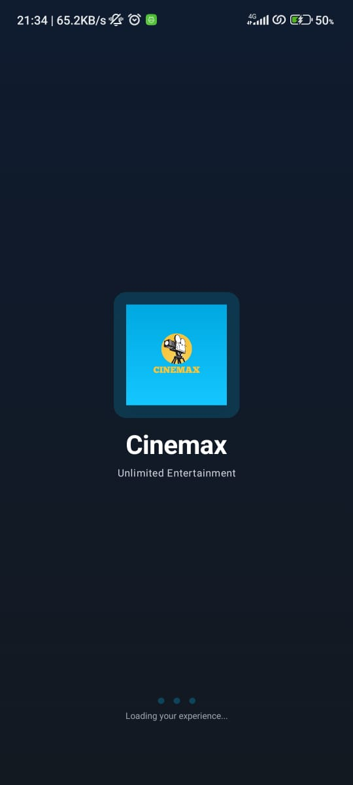
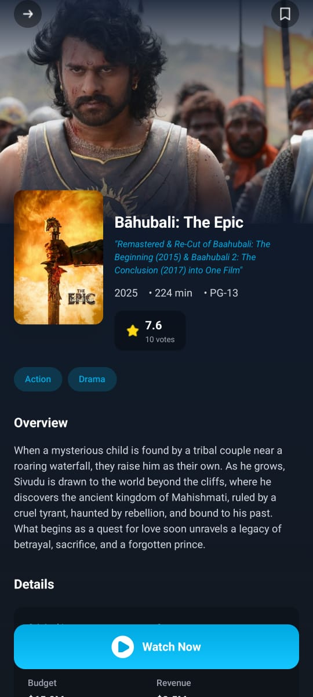
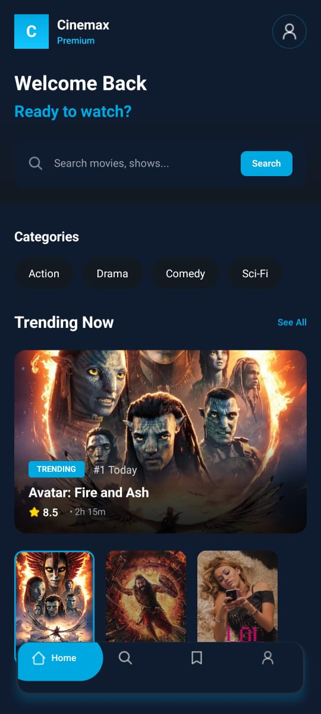
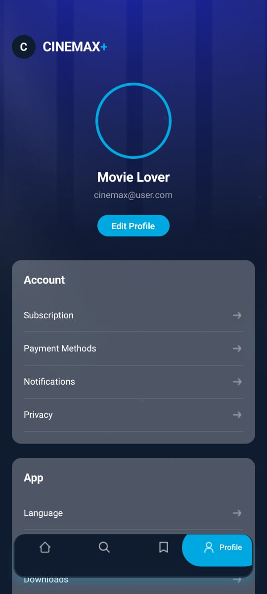
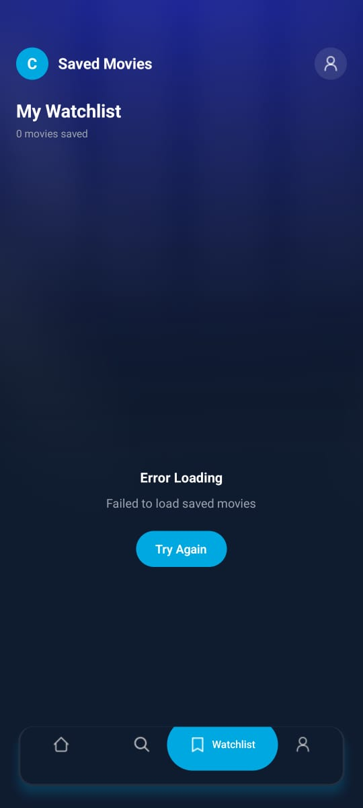
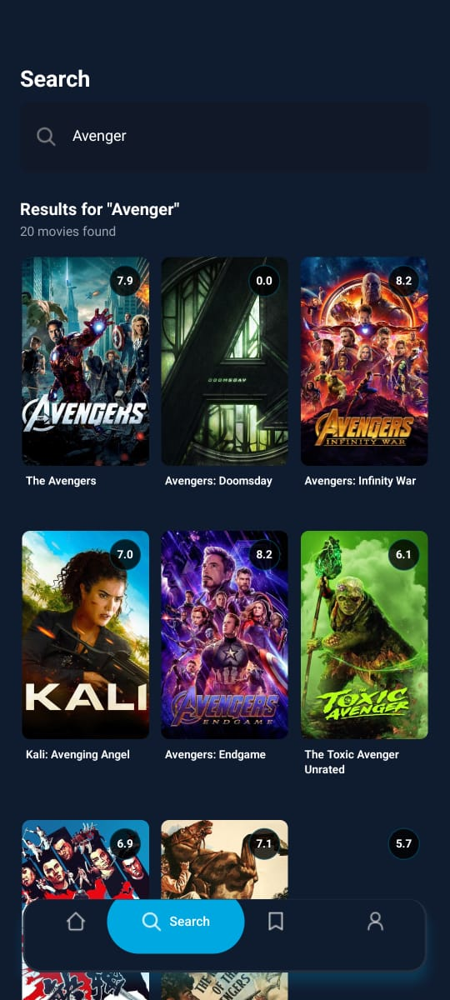

# 🎬 CINEMAX+ - Premium Movie Streaming App

[](https://reactnative.dev/)
[](https://expo.dev/)
[](https://www.typescriptlang.org/)
[](https://www.themoviedb.org/)
[](https://appwrite.io/)
[](https://tailwindcss.com/)


---

## 🧩 Project Overview


CINEMAX+ is a premium movie streaming application built with React Native that delivers Hollywood magic to your fingertips. 
With a sleek dark theme accented by vibrant blues, it offers trending movies, personalized recommendations, and seamless search functionality.

---

## ⚙️ Tech Stack

- **Frontend:** React Native, TypeScript, Expo Router, NativeWind (TailwindCSS), Expo Linear Gradient, Expo Blur, Socket.io Client
- **Backend & API:** TMDB API, Appwrite Cloud (optional), AsyncStorage, AsyncStorage Persistence
- **Local Storage:** AsyncStorage, AsyncStorage for offline caching, AsyncStorage for local data persistence
- **Design & UI:** Custom dark theme with blue accents, React Native Animated, Masked Views, Responsive layouts, Animated components, Responsive design for all screen sizes
- **Real-time Communication:** Socket.io Client connections
- **IDE:** VS Code (frontend & backend)


---

## 📂 Project Structure

- **frontend/** → React Native project with TypeScript components   
- **config/** → Configuration files for database and environment variables  
- **screenshots/** → App screenshots for reference

---


## 🛠️ Setup Instructions

### 1️⃣ Environment Setup

- **Required Software:** Node.js (v18 or higher), npm or yarn, Expo CLI, Android Studio or iOS Simulator, MySQL Workbench or Appwrite Cloud

---

### 2️⃣ API Keys Setup

- **TMDB API:** TMDB Developer Key, API Key added in .env
- **Appwrite Cloud:** Project created, Database created, Table/Collection created (if needed), Project ID added in .env

Create Environment File (`.env`):

```env
# TMDB API Configuration
EXPO_PUBLIC_TMDB_API_KEY=your_tmdb_api_key_here

# Appwrite Configuration (Optional for cloud features)
EXPO_PUBLIC_APPWRITE_ENDPOINT=https://cloud.appwrite.io/v1
EXPO_PUBLIC_APPWRITE_PROJECT_ID=your_appwrite_project_id
EXPO_PUBLIC_APPWRITE_DATABASE_ID=your_database_id
EXPO_PUBLIC_APPWRITE_PROJECT_NAME=cinemax-movies

```
---

### 3️⃣ **Create Expo Projec**

# 1. Create project
npx create-expo-app@latest cinemax --template blank-typescript
cd cinemax

---

### 4️⃣ **Install Dependencies**

 # Install packages
  npm install expo-router tailwindcss nativewind \
  expo-linear-gradient expo-blur \
  @react-native-async-storage/async-storage \
  react-native-url-polyfill appwrite

---

### 5️⃣ **Install Expo Compatible Native Packages**

#  Install Expo supported modules
npx expo install react-native-safe-area-context \
  expo-splash-screen expo-status-bar expo-font


---
### **Complete Dependencies List**

{
  "dependencies": {
    "@react-navigation/bottom-tabs": "^6.5.8",
    "@react-navigation/native": "^6.1.7",
    "@react-navigation/native-stack": "^6.9.13",
    "@react-native-async-storage/async-storage": "1.19.3",
    "expo": "~49.0.15",
    "expo-blur": "~12.3.2",
    "expo-linear-gradient": "~12.3.0",
    "expo-router": "~2.0.0",
    "expo-splash-screen": "~0.20.5",
    "expo-status-bar": "~1.6.0",
    "nativewind": "^2.0.11",
    "react": "18.2.0",
    "react-native": "0.72.6",
    "react-native-dotenv": "^3.4.9",
    "react-native-masked-view": "0.3.0",
    "react-native-safe-area-context": "4.6.3",
    "react-native-screens": "~3.22.0",
    "tailwindcss": "^3.3.5"
  },
  "devDependencies": {
    "@babel/core": "^7.20.0",
    "@types/react": "~18.2.14",
    "@types/react-native": "~0.72.2",
    "@types/react-native-dotenv": "^0.2.2",
    "typescript": "^5.1.3"
  }
}

---
---

### 3. Screenshots

**Splash Screen**  
  


**Single Movie Details**  
  

**Home Page**  
  

**Profile Page**  
  

**Saved Page**  
  

** Search List Page**  
  

---


📱 ** Platforms**

-✅ iOS
-✅ Android
-✅ Web

🛠 **Troubleshooting**

- API Key not working: Regenerate at TMDB
- Images not loading: Check network/API key
- Appwrite errors: Verify project is active
- Build errors: Clear cache: npx expo start --clear


💡 **Note:** Run `npm install` in both frontend and backend directories before starting the project.

📄 **License**

 - MIT License - feel free to use and modify!


